# SUNS Zadnanie 2
Michal Balogh, xbaloghm1@stuba.sk
Oktober 2025

# 1. Priprava dat

Priprava a spracovanie dat pre dalsie ulohy su v subore `trees.ipynb`, v sekcii 1. Data Preparation. Data som nacital pomocou kniznice pandas do dataframe. Dataset obsahuje 8741 riadkov a 12 stlpcov.

Ako prve som odstranil stlpec `instant`, kedze je to len identifikator riadka a nenesie ziadnu informaciu. Taktiez som odstranil stlpec `date`, kedze by sa zle kodovali pre modely, ktore budeme pouzivat (365 unikatnych hodnot). Okrem toho, o case mame informacie zo stlpcov month, weekday a hour. Rok nepotrebujeme zachovat, pretoze vsekty udaje su z jedneho roku - 2012.

V dalsom kroku som skontroloval chybajuce a duplikatne hodnoty. V datasete chybalo v stlpci holiday 11 hodnot (0.13%). Kedze sa jedna o velmi malu cast dat, tieto riadky som odstranil. Odstranil som aj 8 duplikatnych riadkov.

## 1.1 Odstranenie dat nepatriace do specifikovaneho rozsahu
Podla specifikacie dataset obsahuje udaje s nasledujucimi rozsahmi pre spojite atributy:
- temperature: -40,40
- humidity: 0,100
- windspeed: 0,110

A pre diskretne atributy:
- month: 1,12
- hour: 0,23
- weekday: 0,6
- holiday: 0,1
- workingday: 0,1
- count: >=0

Podla tychto pravideil som odstranil 22 riadkov, ktore mali zaporne hodnoty v stlpci `humidity`.

## 1.2 Kodovanie kategorickych atributov
V datasete sme mali 12 stlpcov, z toho 2 sme odstranili. Zo zvysnych 10 stlpcov je 9 numerickych a len 1 kategoricky - `weather`. Ten som zakodoval cez `label encoding`, kedze ma len 4 unikatne hodnoty a poradie medzi nimi dava zmysel - od najlepsieho po najhorsie pocasie.
Kodovanie:
- clear: 0
- cloudy: 1
- light rain/snow: 2
- heavy rain/snow: 3

## 1.3 Analyza outlierov
Pre analyzu outlierov som pouzil pravidlo 1.5*IQR pre spojite atributy, kedze pre ostatne to nema zmysel. Outliery ma len stlpec `windspeed`, a to 175 hodnot (2.01%). Tieto hodnoty som odstranil. Boxplot s outlierami je na obrazku outliers_windspeed.

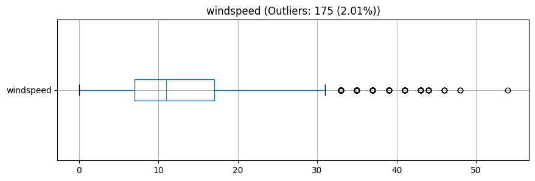

## 1.4 Finalne rozmery datasetu
Po spracovanie dat mam finalny dataset s rozmermi 8525 riadkov a 10 stlpcov.

# 2. EDA

Ako prve som analyzoval priemerny pocet pozicanych bicyklov podla hodiny a mesiaca. Graf je na obrazku eda_rentals_hour_and_month.
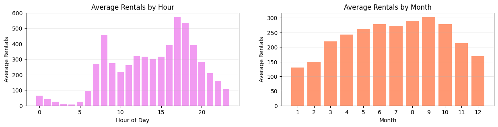
Z grafu vidime, ze bicykle sa viac poziciavaju v teplych mesiacoch (sezona) - od aprila do septembra. Najvyssie poziciavania su v mesiaci september.
Co sa tyka hodin, najviac si ludia poziciavaju bicykle v rano okolo 8 hodiny, a potom poobede okolo 17-18 hodiny. To su casy, kedy ludia chodia do prace a z prace.

Dalsi graf zobrazuje priemerny pocet pozicanych bicyklov v danej hodine v pracovnych dnoch (ruzova) a cez vikend a sviatky (modra). Graf je na obrazku eda_rentals_pattern.
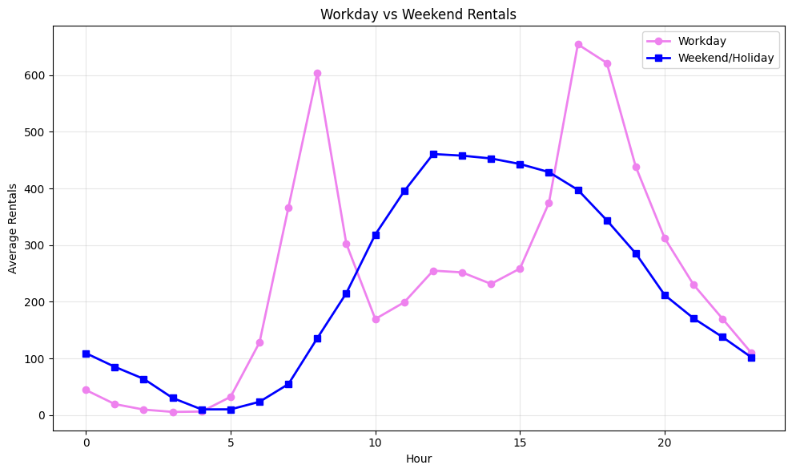
Z grafu vidime, ze v pracovnych dnoch je vyrazny nárast poziciavani bicyklov v rano okolo 7-9 hodiny a potom poobede okolo 16-18 hodiny. Naopak cez vikend a sviatky je poziciavanie bicyklov rozlozene rovnomernejsie pocas dna, s vrcholmi okolo 11-15tej hodiny, ked ludia vyuzivaju bicykle na rekreaciu.

Na grafe eda_weather je zobrazena distribucia pocasia v datasete. Na grafe v lavo je priemer a median poctu poziciavani bicyklov pre jednotlive kategorie pocasia.
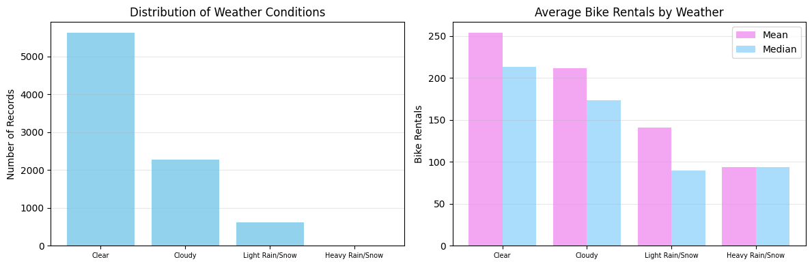
Najviac bicyklov sa poziciava pocas jasneho (clear) a pocas oblacneho (cloudy) pocasia.

Graf eda_heatmap zobrazuje priemerny pocet pozicanych bicyklov podla hodiny a mesiaca v heatmape.
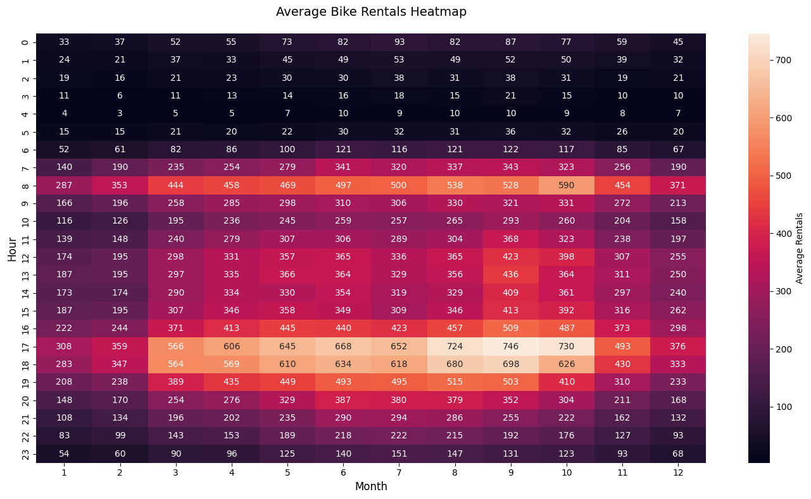
Na heatmape je najasnejsi peak v mesiacoch august, september a oktorber okolo 17-18tej hodiny. Dalsie jasne peaky su v mesiaoch marec az jul, tiez okolo 17-18tej hodiny. Okrem toho este v mesiacoch marec za okolo osmej hodiny rano.

Zhrnutie peakov poziciavani bicyklov pocas pracovnych a nepracovnych dni je v tabulke eda_rentals_table.
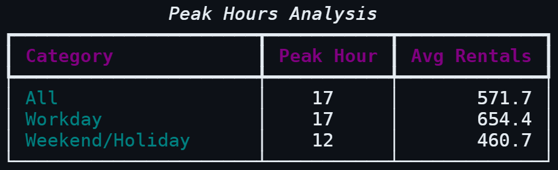

# 3. Rozdelenie dat na trenovacie a testovacie

Data som rozdelil na trenovacie a testovacie v pomere 8:2 pomocou funkcie `train_test_split` z kniznice `sklearn.model_selection`.

Data som skaloval pomocou `StandardScaler`.

# 4. Trening Modelov

Trening modelov je v subore `trees.ipynb`, v sekcii 4. Model Training. Pouzil som tri modely: Decision Tree Regressor, Random Forest Regressor a Support Vector Machine z kniznice `sklearn`.

## 4.1 Decision Tree
Na najdenie najlepsej hlbky rozhodovacieho stromu som postupne cez cyklus skusal hodnoty od 1 do 100. Najelepsejsiu hodnotu som nasiel pri hlbke 10. Model dosiahol na testovacich datach R2 0.889.

Tabulka s vysledkami pre hlbku stromu 1 az 10 je na obrazku tree_max_depth_table.
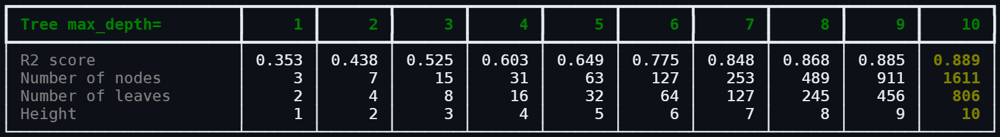

Kedze hlbka 10 sa uz zle vizualizuje, zvolil som pre vizualizaciu stromu hlbku 3. Vizualizacia rozhodovacieho stromu je na obrazku tree_viz.

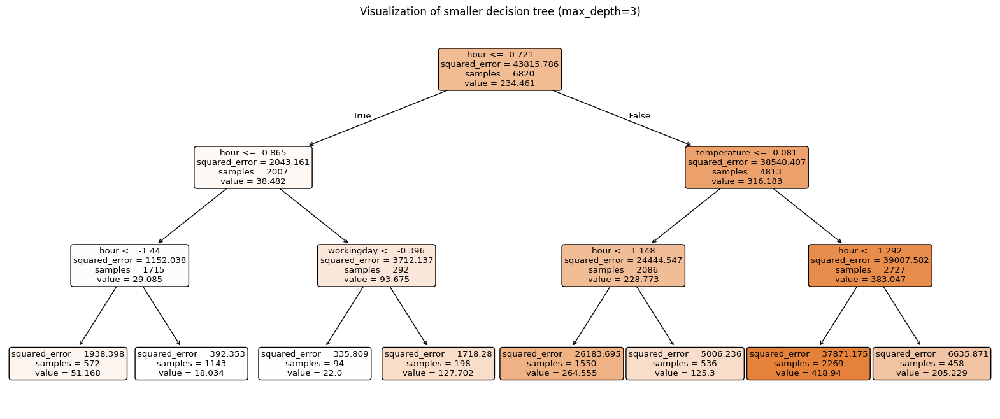

Na strome mozme vidiet, ze najdolezitejsi atribut pre rozhodovanie je atribut `hour`. Je v koreni stromu a zaroven v dalsich styroch uzloch - dokopy 5 zo 7 rozhodovacich uzlov. Nasledne je dolezity atribut `temperature` a `workingday`.

Tento strom s hlbkou 3 dosiahol na testovacich datach R2 0.525.

## 4.2 Random Forest

Pre Random Forest som skusal rozny pocet stromov v lese (n_estimators) a rozhodol som sa pre hodnotu 10, ktora sice nedosiahla najlepsie vysledky, ale bola dostatocne rychla a zvacsovanim poctu stromov sa uz vysledky velmi nezlepsovali.

Model dosiahol na testovacich datach s poctom stromov v lese 10 R2 0.925. Pre pocet stromov v lese 100 dosiahol model R2 0.934, co je zlepsenie len o 0.009 oproti 10 stromom.

Priznaky, podla ktorych sa rozhodoval Random Forest, su zobrazeny na obrazku importance_of_input_features.
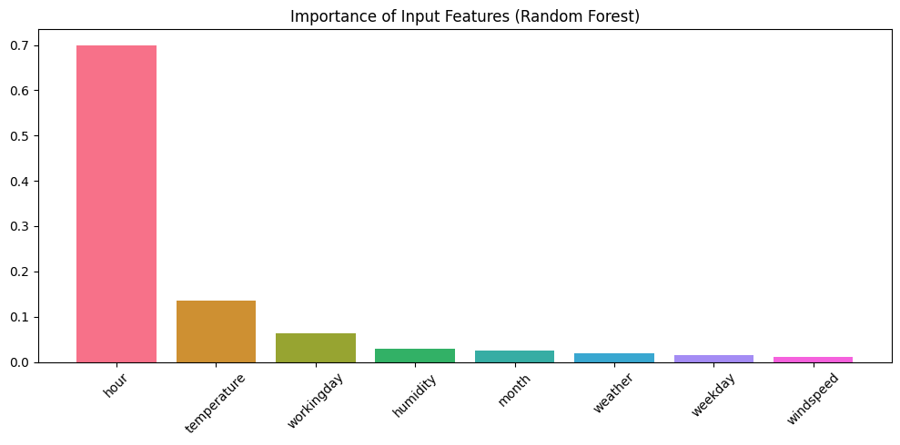

Potvrdilo sa to, ze najdolezitejsi atribut je `hour`, nasledne `temperature` a `workingday`. Atribut `hour` poskytuje az priblizne 70% dolezitosti v rozhodovani modelu, nasledne `temperature` priblizne 13% a `workingday` okolo 6%. Zvysne atributy uz maju podobne malu dolezitost.

## 4.3 Support Vector Machine (SVM)

Pre support vector machine som skusal rozne jadra (kernel) a najlepsie vysledky som dosiahol s jadrom 'rbf' (radial basis function). Parameter C (regularizacia) som nastavil na hodnotu 100, ktora dosiahla lepsie vysledky ako nizsie hodnoty.

Model dosiahol R2 skore 0.554.

## 4.4 Porovnanie a vyhodnotenie modelov
Porovnanie všetkých troch modelov (Decision Tree, Random Forest a SVM) je uvedené v tabuľke nižšie. Modely boli vyhodnotené pomocou metrík R2, RMSE, MSE na trénovacích aj testovacích dátach.

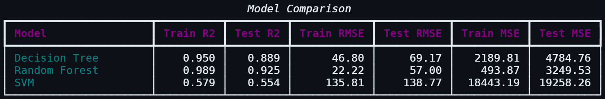

Random Forest dosiahol najlepšie výsledky zo všetkých troch modelov:
- Test R2 skóre: 0.925, čo znamená, že model vysvetľuje 92.5% variability v dátach
- Test RMSE: 57.00, čo predstavuje priemernú odchýlku predikcie
- Vysoké trénovacie R2 (0.989) naznačuje mierne pretrenovanie (overfitting), ale rozdiel oproti testovaciemu R2 nie je dramatický

Decision Tree s optimálnou hĺbkou 10 dosiahol:
- Test R2 skóre: 0.889, čo je o 0.036 horšie ako Random Forest
- Test RMSE: 69.17
- Výrazný rozdiel medzi trénovacím (0.950) a testovacím R2 naznačuje mierne pretrenovanie

Support Vector Machine (SVM) dosiahol najhoršie výsledky:
- Test R2 skóre: 0.554, výrazne nižšie ako stromové modely
- Test RMSE: 138.77, viac ako dvojnásobne vyššie ako Random Forest
- Podobné výsledky na trénovacích aj testovacích dátach (0.579 vs 0.554) naznačujú, že model nie je pretrenovaný, ale len nedokáže dobre zachytiť vzťahy medzi dátami s daným nastavením hyperparametrov

#### Analýza reziduálov

Grafy reziduálov (rozdiely medzi skutočnými a predikovanými hodnotami) pre všetky tri modely sú zobrazené nižšie:

Decision Tree:
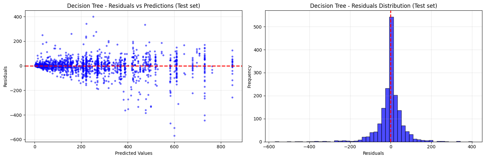

Random Forest:
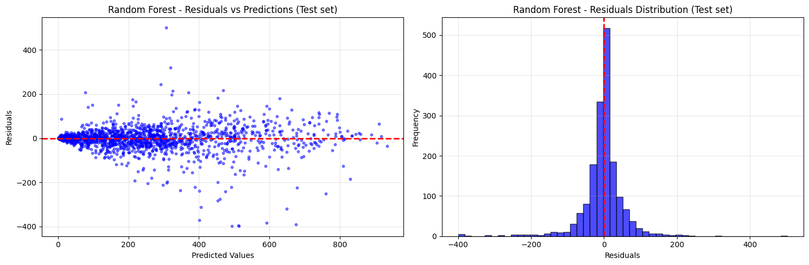

SVM:
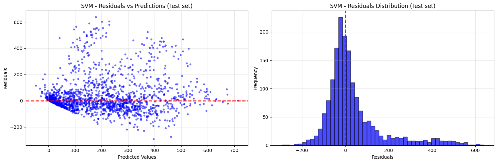

Z grafov reziduálov možno pozorovať, že Random Forest má najmenšie rozptýlenie reziduálov a najlepšie sa približuje k ideálnemu stavu (reziduály okolo nuly). Distribucia rezidual je symetricka okolo nuly (priblizne normalne rozdelena), co je znamka dobreho modelu.

Decision Tree má o niečo väčšie rozptýlenie, ale stále prijateľné. Distribucia reziduálov je mierne zosikmena do lava.

SVM už má značné chyby s veľkým rozptýlením reziduálov. V grafe s distribuciou reziduálov sú dáta zošikmené zprava, čo znamená, že model má tendenciu podhodnocovať niektoré vysoké hodnoty (predpovede sú príliš nízke oproti realite).
Inak povedane - model nevie dobre zachytiť extrémne vysoké hodnoty cieľovej premennej.

#### Porovnanie R2 skóre na mnozine train a test

Vizuálne porovnanie R2 skóre pre všetky modely pre trenovacie a testovacie dáta je na grafe r2_comparison.

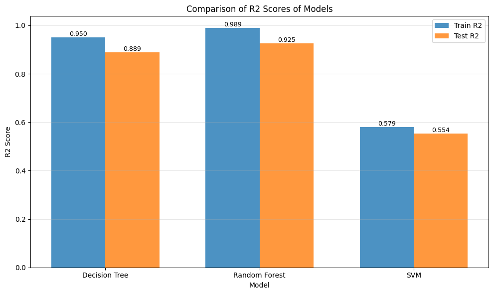

Z grafu vidno, ze medzi trenovacimi a testovacimi datami nie je az taky velky rozdiel. Z toho vyplyva, ze modely nie su pretrenovane.

#### Predikcie a skutočné hodnoty

Grafy porovnania predikovaných a skutočných hodnôt pre testovací súbor pre vsetky model su  na grafoch nizsie.

Decision Tree:
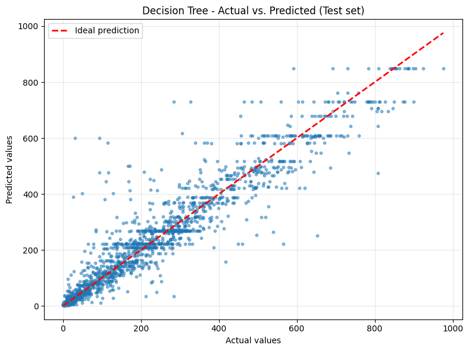

Random Forest:
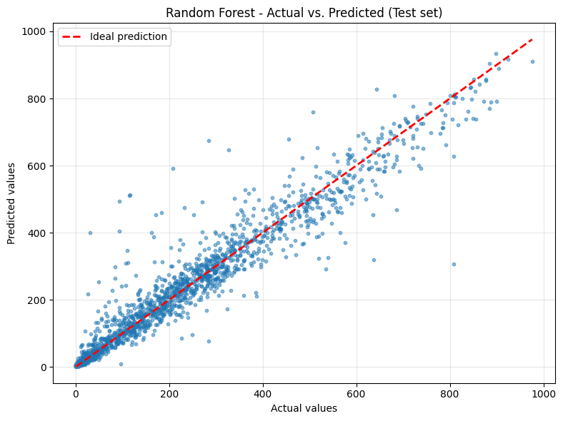

SVM:
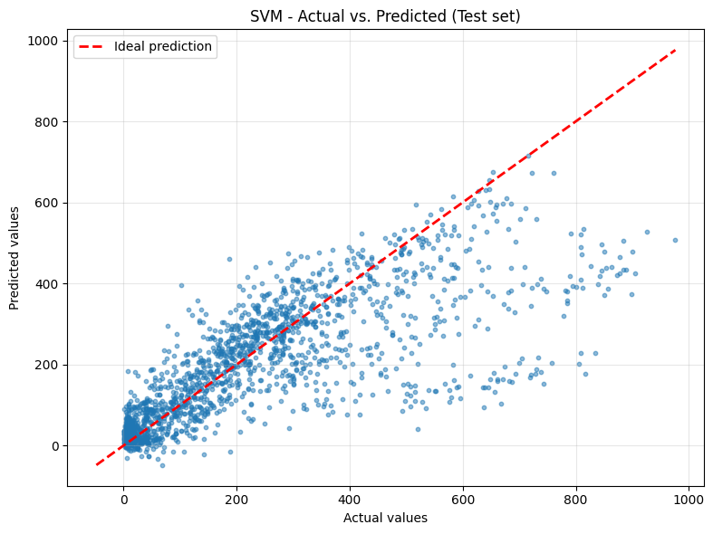

Ideálne predikcie by mali ležať na červenej čiare (y = x). Väčšina bodov sa drží blízko diagonály, najmä pri nižších hodnotách, takze model sa celkom dobre trafí pre menšie reálne hodnoty. Pri SVM pri väčších hodnotách (napr. nad 400–500) sa body začínajú rozptyľovať pod čiaru, co znova potvrdzuje, že model podhodnocuje vyššie hodnoty.

# 5. Redukcia dimenzie

V tejto casti som vizualizoval data v 3D priestore pomocou dvoch metod: 3D scatter plot, kedy som vybral 3 priznaky a PCA (Principal Component Analysis).

## 5.1 3D Scatter Plot

Ako 3 priznaky, ktore som vyniesol do 3D grafu som zvolil `hour`, `temperature` a `weather`. Prve dva su najdolezitejsie priznaky podla analyzy dolezitosti priznakov z Random Forest modelu. Tretim priznakom je `weather`, ktory som zvolil preto, lebo sa jednoduchsie interpretuje. Atribut `weather` ma 4 unikatne hodnoty, ktore su reprezentovane cislami 0-3 po label encodingu.

Graf je na obrazku 3d_plot.
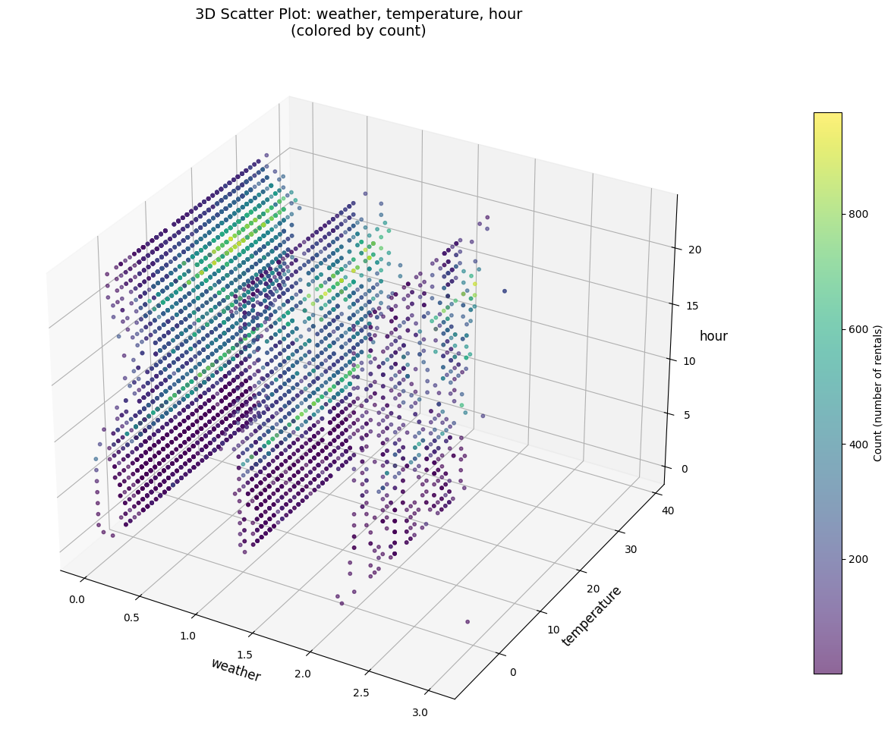

Atribut `weather` nam rozdelil data na pekne 4 zhluky. V poslednom zhluku - `heavy rain/snow` (3) je len jedna bodka - pocas velmi nepriazniveho pocasia je poziciavanie bicyklov velmi nizke. Na druhej strane, pri pocasi `clear` (0) je najvacsi pocet bodov a z druhych dvoch osi mozme vycitat, ze najvyiac poziciavani bicyklov je medzi 14-16 hodinou a pri teplote okolo 20-30 stupnov.

## 5.2 PCA

Po aplikácii PCA na škálované trénovacie dáta som získal graf na obrazku pca_3d.
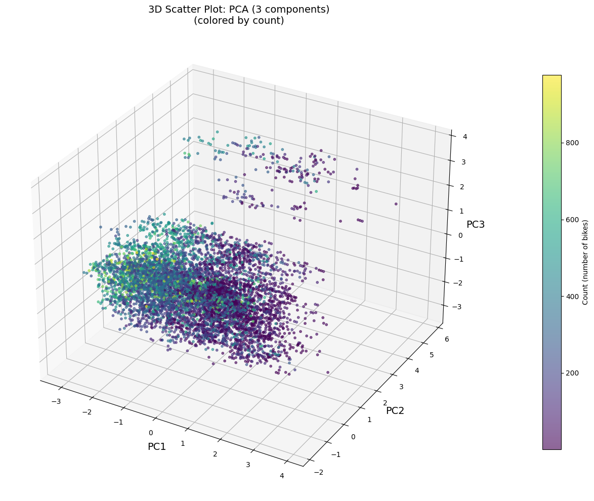

Väčšina bodov je v hustej oblasti, čo znamená, že tieto dáta majú podobné vlastnosti. Nie sú zrejme žiadne jasné clustre. Bodky s vysokými hodnotami count (žlté) sa sustreduju relativne blizko v zhlukoch grafu, čo môže indikovať, že existujú kombinácie podmienok (počasie, deň v týždni, hodina...), ktoré vedú k vysokej aktivite bicyklov. Outliery mimo hlavny zhluk môžu predstavovať špecifické situácie, ako napríklad extrémne počasie alebo sviatky.

Po redukcii dimenzie na tri hlavné komponenty PCA som analyzoval váhy (loadings) pôvodných premenných na týchto komponentoch:
| Komponenta | Vysvetlená variabilita | Hlavné váhy (loadings)                     | Interpretácia                      |
|-------------|------------------------|--------------------------------------------|------------------------------------|
| PC1         | 19.2 %                 | +humidity, +weather, –temperature, –windspeed | Počasie (nepriaznivé vs. priaznivé) |
| PC2         | 14.9 %                 | +holiday, –workingday, –weekday                     | Typ dňa (víkend/sviatok vs. pracovný deň) |
| PC3         | 13.2 %                 | +month, +temperature, –windspeed                     | Sezóna (leto vs. zima) |
| Celkovo     | 47.3 % variability     | –                                              | Takmer polovica informácií v dátach |

# 7. Trenovanie na podmnozine priznakov

V tejto casti som trénoval najlepsi model -  Random Forest na zmensenej mnozine priznakov. Mnozinu priznakov som zmensil tromi metodami:
- podla korelacnej matice
- podla dolezitosti priznakov z Random Forest
- pomocou PCA

## 7.1 Korelacna matica

Korelacna matica priznakov je na obrazku corr_mat.

Priznaky, ktore korelovali s cielovou premennou `count` viac ako stanoveny threshold 0.1 som vybral ako nove priznaky pre trenovanie modelu. Tychto priznakov bolo 5: `hour`, `temperature`, `humidity`, `weather` a `windspeed`.

Model dosiahol na testovacich datach R2 0.694. Test RMSE sa zhorislo na 114.86.

## 7.2 Dolezitost priznakov z Random Forest

Graf dolezitosti priznakov z Random Forest uz bol v sekcii 4.2, na obrazku importance_of_input_features.

Kumulativnym suctom som chcel pokryt aspon 90% dolezitosti priznakov. To som dosiahol len s 3 priznakmi: `hour`, `temperature` a `workingday`. To znamena, ze tieto 3 priznaky zodpovedaju za 90% rozhodovania modelu.

Model dosiahol na testovacich datach R2 0.839. Test RMSE sa zhorsilo na 83.30.

## 7.3 PCA

Pre PCA som zvolil threshold 90 % vysvetlenej variability. Túto hodnotu som dosiahol s ôsmimi komponentmi. Osem komponentov pokrylo 95.3 % variability dát.
Kumulativny sucet vysvetlenej variability je na obrazku cumsum_expl_var.
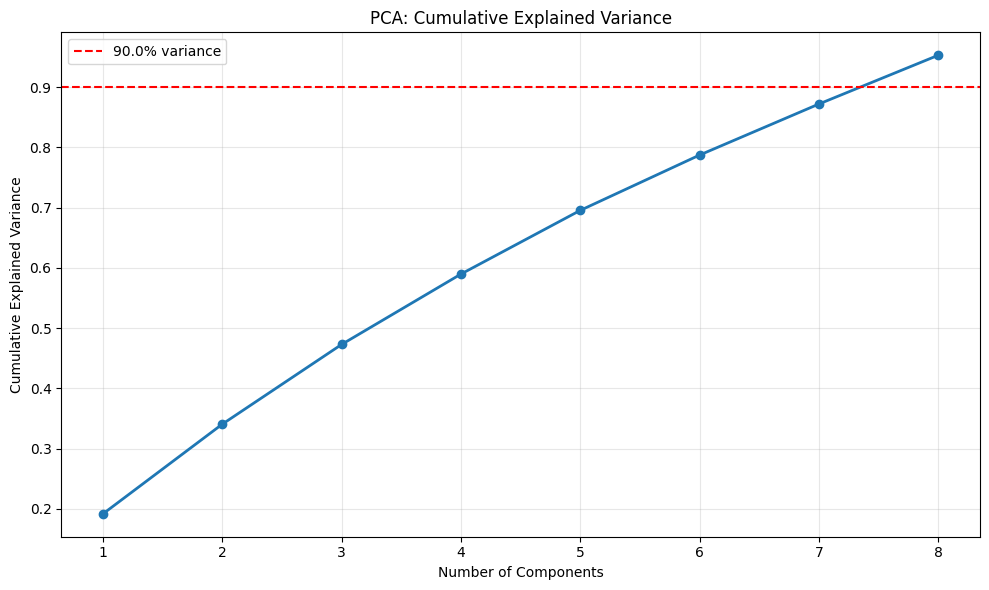

Model dosiahol na testovacich datach R2 0.583. Test RMSE sa zhorsilo na 134.14.

## 7.4 Porovnanie vysledkov na zmensenej mnozine priznakov

Porovnanie vysledkov modelu Random Forest na zmensenej mnozine priznakov je v tabulke feature_selection_methods_table.
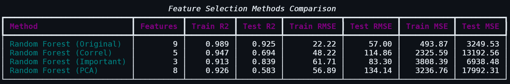

Najlepsie vysledky boli dosiahnute na originalnej mnozine priznakov. Zmensenie mnoziny priznakov sposobilo zhorsenie vysledkov vo vsetkych pripadoch. Najmenej sa vysledky zhorsili pri vybere priznakov podla dolezitosti priznakov z Random Forest. Metrika R2 sa zhorsila o 0.086 a RMSE sa zhorsilo o 26.30.

Z vysledkov vyplyva, ze vsetky priznaky v datasete prinasaju nejaku hodnotu pre model a ziadny z nich by sa nemal odstranovat, ak na to nie je vazny dovod.

Porovnanie metriky R2 na trenovacej a testovacej mnozine pre jednotlive redukcie priznakov je na grafe features_barplot. Vedla neho je graf, ktory ukazuje, kolko priznakov bolo pouzitych v kazdej metode.
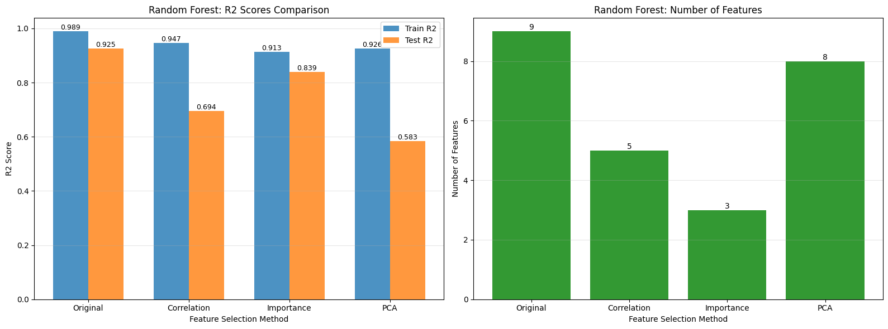

Graf rezidualov pre jednotlive metody a distribucia rezidualov je na obrazku features_residuals.
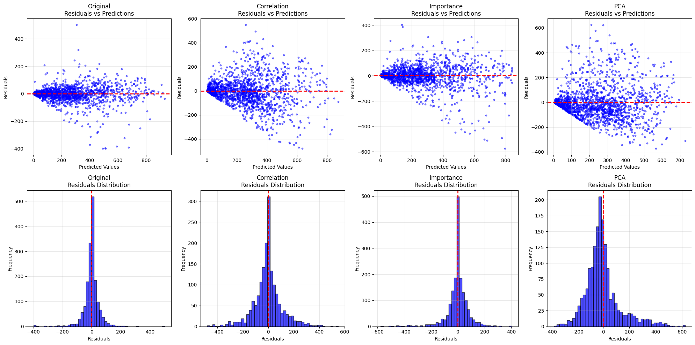

Z grafu vidno, ze najmensie rozptýlenie reziduálov má model trénovaný na pôvodnej množine príznakov. Modely na zmenšených množinách majú väčšie rozptýlenie a ich reziduály sú menej symetrické okolo nuly. Vyber priznakov podla dolezitosti priznakov z Random Forest ma najmensie rozptýlenie spomedzi zmensenych mnozin, no vyrazne podhodnocuje vysoke hodnoty.  To vidno aj v grafe distribucie rezidualov, kde su rezidualy zosikmene zprava.

# 8. Zhlukovanie dat

Data som zhlukoval pomocou KMeans do 6 zhlukov. V 3D grafe su zhluky zobrazené farbami. Na osi som dal 3 spojite atributy: `humidity`, `windspeed` a `temperature`. Graf je na obrazku clusters.

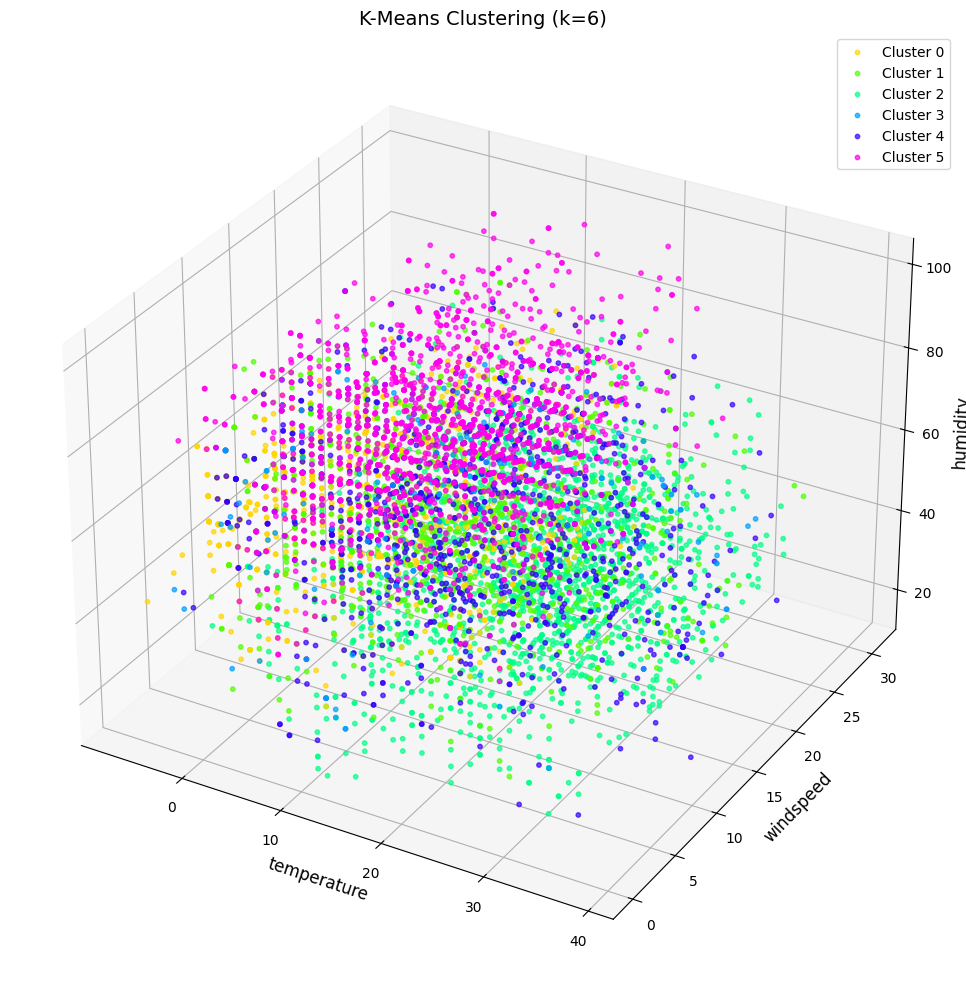

Nevidime jasne oddelene zhluky, co indikuje, ze data su pomerne rovnomerne rozlozene v priestore a nie su prirodzene zhlukovane.

Najlepsi model, Random Forest, som nasledne natrenoval na jednotlive zhluky a porovnal predikcie s povodnym modelom. Tabulka s vysledkami aj vahovanym priemerom je na obrazku clusters_vs_original_table.

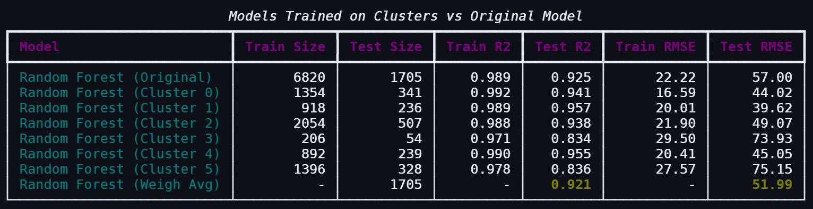

Pre vacsinu zhlukov model dosiahol lepsie vysledky ako povodny model. Iba v zhlukoch 3 a 5 bol vysledok horsi. To moze byt preto, ze tieto zhluky obsahuju dost malo dat, co sposobuje pretrenovanie.

Vahovany priemer vsetkych zhlukov dosiahol R2 0.921, co je sice horsie ako povodny model s R2 0.925, no test RMSE sa znizilo z 57.00 na 51.99, co je vyrazne zlepsenie.

Podrobnejsia analyza jednotlivych zhlukov je v tabulke clusters_analysis_table.
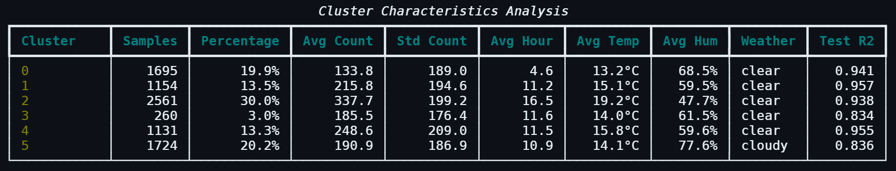

# 9. Neuronova siet

Kedze ide o regresiu, vystupom neuronovej siete je jedna spojita hodnota - predikovany pocet poziciavani bicyklov.

Architekura siete obsahuje:
- Vstupna vrstva s 9 neuronmi (9 priznakov po spracovani dat)
- 3 skryte vrstvy s 128, 64 a 32 neuronmi
- Výstupná vrstva s 1 neuronom (predikcia spojitej hodnoty)
- Aktivacna funkcia ReLU v kazdej skrytej vrstve

Ako optimalizator som pouzil Adam. Stratovu funkciu som zvolil Mean Squared Error (MSE), kedze sa jedna o regresiu.

Hypereparametre pre siet su nastavene takto:
+--------------------------+----------------+
| Hyperparameter           | Hodnota        |
+--------------------------+----------------+
| Learning Rate            | 1e-3           |
| Batch Size               | 256            |
| Epochs                   | 500            |
| Early Stopping Patience  | 30             |
+--------------------------+----------------+

Priebeh trenovania siete a vyvoj R2 skore je na obrazku training_curves.
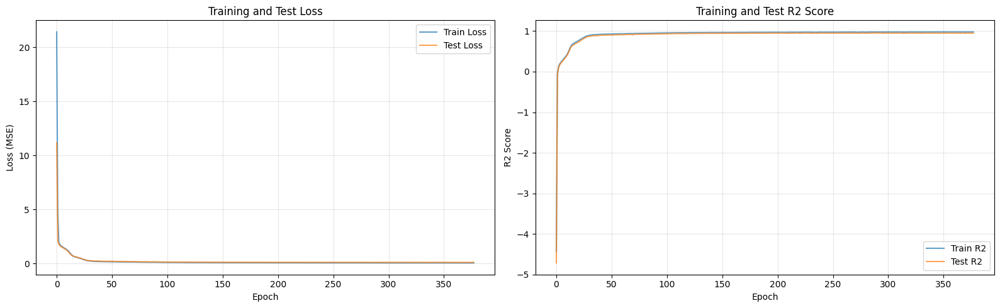

Trenovanie sa zastavilo po 406 epochach vdaka early stoppingu, kedze sa R2 skore na validacnej mnozine prestalo zlepsovat.
Model dosiahol na testovacich datach R2 0.9379 a RMSE 53.87.

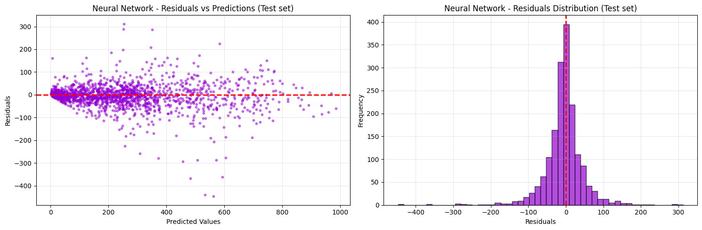

Graf rezidualov ukazuje, ze rezidualy su symetricke okolo nuly a vacsina bodov je blizko nule, co indikuje dobry model. Distribucia rezidualov je priblizne normalna, s miernym zosikmenim do prava, co opat indikuje, ze model ma tendenciu podhodnocovat velmi vysoke hodnoty.
